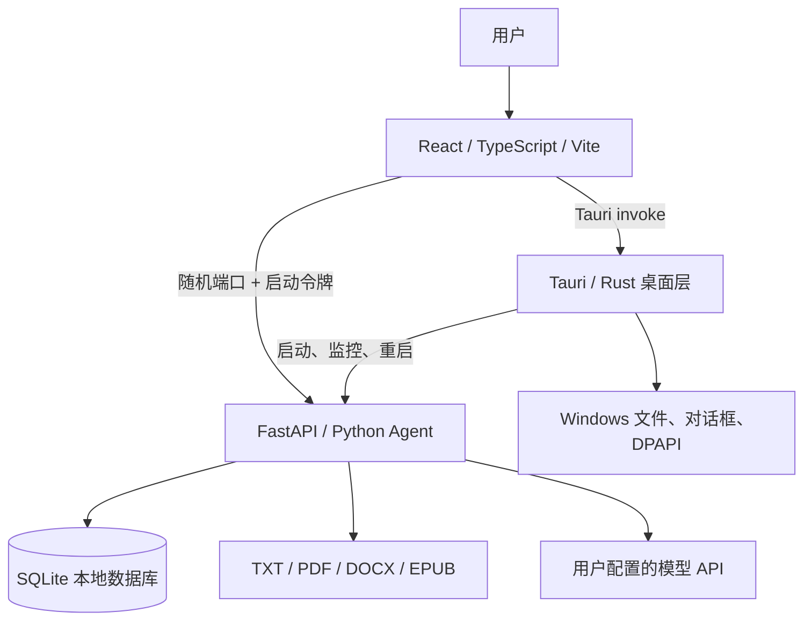
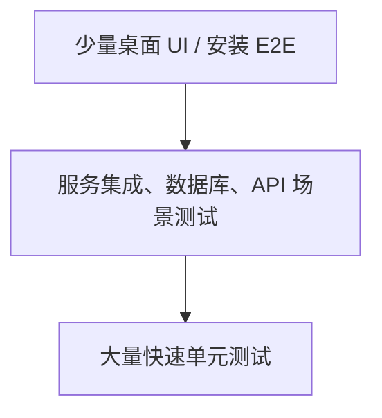

# NovelForge 全栈桌面应用开发全流程

> 从想法、需求、架构、全栈开发、测试和安装包，到发布、运维、运营与持续迭代

本文以 NovelForge `0.1.0` 的真实代码为案例，面向第一次独立开发桌面应用、主要通过 Vibe Coding 推进项目的开发者。它不是一篇只讲技术栈的教程，而是一套可以重复执行的软件工程流程。

文档基线：2026-07-22，NovelForge `v0.1.0`。

---

## 1. 先建立正确的软件开发观念

一个“完整项目”不等于功能都写完。完整项目至少要同时满足以下条件：

1. 用户问题明确，核心流程能够产生真实价值。
2. 架构边界清楚，新功能知道应该放在哪一层。
3. 数据能够保存、迁移、备份和恢复。
4. 正常流程、异常流程和恢复流程都经过测试。
5. 能生成安装包，能安装、启动、升级和卸载。
6. 出现故障后，能够诊断、止损、修复和发布补丁。
7. 用户知道如何下载、配置、使用、反馈问题。
8. 团队能够根据指标和反馈决定下一步，而不是凭感觉不断加功能。

软件开发不是一次性的直线过程，而是不断缩短的闭环：


对 Vibe Coding 来说，AI 可以显著加快 D，但如果缺少 B、C、E、G，速度越快，返工也越快。真正提高效率的方法不是让 AI 写更多代码，而是让每次修改都有清晰边界、验收标准和反馈闭环。

### 1.1 如何使用本文

- 第一次阅读：按章节顺序阅读，理解项目从 0 到上线的完整链路。
- 开发一个新功能：重点执行第 7、8、9、13 章。
- 准备发布：直接使用第 10 章和第 15 章的清单。
- 项目不知道下一步做什么：查看第 14 章的现状与路线图。
- AI 修改越来越混乱：严格使用第 13 章的“变更任务包”。

### 1.2 独立开发者需要切换的角色

一个人开发不代表只有“程序员”这个角色。你需要在不同时间戴不同的帽子，但不要在同一时刻混在一起：

| 角色 | 主要问题 | 典型产物 |
| --- | --- | --- |
| 产品经理 | 用户为什么需要它 | 问题陈述、PRD、优先级 |
| UX 设计 | 用户能否自然完成任务 | 用户流程、线框图、交互状态 |
| 架构师 | 代码和数据应该放在哪里 | 架构图、ADR、接口和数据模型 |
| 全栈开发 | 如何正确实现 | 小范围代码、迁移、提交 |
| QA | 它会在哪里失败 | 测试计划、用例、回归证据 |
| 安全负责人 | 什么可能泄露或被滥用 | 威胁模型、安全检查 |
| 发布工程师 | 用户拿到的包是否可靠 | 版本、签名、安装验收 |
| 运维与支持 | 出错后如何发现和恢复 | 日志、诊断、故障流程 |
| 运营 | 用户是否找到并持续使用 | 内容、渠道、指标、反馈 |

推荐的切换顺序是：先以产品角色定义问题，再以设计和架构角色约束方案，然后才让开发角色写代码；代码完成后切换成 QA 和安全角色主动找问题。不要一边写代码，一边临时改变产品目标。

---

## 2. NovelForge 项目全景

### 2.1 产品定位

NovelForge 是一款本地优先的 AI 长篇小说创作桌面应用。用户自行配置 OpenAI 或兼容 Chat Completions 的模型服务，应用负责素材分析、作品管理、连续生成、结构化记忆、版本恢复、备份和多格式导出。

当前核心用户旅程是：

```text
安装应用
  -> 配置模型 API
  -> 创建作品
  -> 导入并分析素材
  -> 规划故事结构与规则
  -> 对话、生成或修改章节
  -> 确认和管理章节
  -> 检查交付完整性
  -> 导出 TXT / PDF / EPUB
```

### 2.2 当前工程规模

| 项目 | 当前数量 |
| --- | ---: |
| Git 跟踪文件 | 约 80 个 |
| 主要代码 | 约 15,500 行 |
| FastAPI 路由 | 67 个 |
| SQLite 数据表 | 17 张 |
| React 业务组件 | 17 个 |
| Zustand Store | 5 个 |
| Python 自动化测试 | 87 项 |
| Rust 自动化测试 | 10 项 |
| 正式版本 | `0.1.0` |

这些数字不是质量目标，只用于理解复杂度。项目越大，越不能只靠记忆维护。

### 2.3 仓库结构与职责

```text
Novelai/
├─ web-frontend/              React + TypeScript 用户界面
│  ├─ src/components/         面板、设置、导出、故事结构等组件
│  ├─ src/stores/             会话、章节、素材、模式等客户端状态
│  ├─ src/api/client.ts       前端访问本地 Agent 的统一入口
│  └─ src/App.tsx             应用编排和主要业务交互
├─ src-tauri/                 Tauri + Rust 桌面外壳
│  ├─ src/main.rs             Agent 生命周期、健康检查、诊断
│  ├─ src/commands.rs         文件、导出、配置加密等系统能力
│  ├─ capabilities/           桌面权限白名单
│  └─ tauri.conf.json         窗口、安全策略和安装包资源
├─ python-agent/              FastAPI + Python 业务服务
│  ├─ app.py                  HTTP API 和业务流程编排
│  ├─ agent.py                模型调用、提示词流程和生成逻辑
│  ├─ database.py             SQLite 模型、迁移、备份和恢复
│  ├─ tools.py                文件解析、导出、辅助工具
│  ├─ models.py               API 输入模型
│  └─ tests/                  单元、集成、场景和验收测试
├─ scripts/                   构建、版本检查、安装器验收
├─ .github/workflows/         CI 和 Windows Release 自动化
└─ docs/                      发布与工程文档
```

### 2.4 三层桌面架构



各层边界：

| 层 | 应该负责 | 不应该负责 |
| --- | --- | --- |
| React | 展示、交互、客户端临时状态、调用 API | 直接操作数据库、保存明文密钥 |
| Rust/Tauri | 窗口、系统权限、文件对话框、配置加密、进程管理 | 编写大量 AI 业务规则 |
| Python Agent | AI 流程、业务规则、文件处理、数据库事务 | 随意调用超出权限的桌面系统能力 |
| SQLite | 持久化、约束、索引、事务 | 承担 UI 状态或外部服务调用 |

判断代码放在哪里的简单规则：

- 用户看得见、只影响界面的状态放 React。
- 需要 Windows 权限、进程和安全存储的能力放 Rust。
- 作品、章节、AI、文件分析等业务放 Python。
- 需要跨启动保留且可查询的数据放 SQLite。

### 2.5 一次启动的真实过程

1. 用户启动 `novelforge.exe`。
2. Rust 找到安装包中的 `novelforge-agent.exe`。
3. Rust 分配随机本机端口，并生成随机访问令牌和实例 ID。
4. Rust 通过环境变量把数据库路径、端口和令牌传给 Agent。
5. Python 初始化数据库并启动 FastAPI。
6. Rust 轮询 `/health`，确认实例 ID 匹配后认为 Agent 可用。
7. React 通过 Tauri 获取连接信息，之后访问本机 API。
8. Rust 持续监控 Agent，异常时尝试恢复并生成诊断信息。

这条启动链路解释了为什么“网页能显示”不等于“应用启动成功”。`v0.1.0` 的安装验收曾真实发现：主窗口启动了，但安装包中的 Agent 路径错误，数据库没有初始化。工程测试必须验证业务服务，而不只是验证进程存在。

### 2.6 本地数据与秘密

- 创作数据库：`%APPDATA%\NovelForge\storage\novel_forge.db`
- Agent 日志：`%APPDATA%\NovelForge\logs\`
- API 配置：Tauri Store 的 `settings.json`
- API Key：Windows 下使用 DPAPI 加密，只能由当前 Windows 用户解密
- 自动备份：数据库同级的 `backups` 目录，当前保留 7 份
- 章节历史：每章当前最多保留 50 个版本

这些运行时文件都在仓库外，不应该进入 Git 或安装包。

---

## 3. 从 0 到上线的阶段地图

| 阶段 | 要回答的问题 | 主要产物 | 通过标准 |
| --- | --- | --- | --- |
| 0. 机会发现 | 谁有什么问题 | 用户访谈、问题陈述 | 问题真实且重复发生 |
| 1. 产品定义 | 第一版解决什么 | PRD、用户旅程、MVP 范围 | 范围可在固定周期完成 |
| 2. 技术设计 | 系统如何实现 | 架构图、数据模型、ADR、威胁模型 | 边界和风险清楚 |
| 3. 工程初始化 | 如何稳定协作 | 仓库、环境、CI、规范 | 新机器可重复启动 |
| 4. 纵向切片 | 最小闭环能否工作 | 一条端到端业务链 | 真实用户能完成一次目标 |
| 5. 功能扩展 | 如何持续增加价值 | 小步功能、迁移、测试 | 每项都有验收证据 |
| 6. 质量建设 | 是否可靠安全 | 测试矩阵、性能基线、安全检查 | 关键路径达到质量门禁 |
| 7. 发布准备 | 用户能否安装 | 版本、安装包、签名、说明 | 干净环境验收通过 |
| 8. 上线运营 | 用户是否真正使用 | 下载渠道、支持、指标、反馈 | 能发现和处理用户问题 |
| 9. 持续迭代 | 下一步是否正确 | 路线图、实验、复盘 | 数据和反馈驱动决策 |

阶段可以重叠，但不能长期跳过。例如可以先做纵向切片再完善架构文档，但不能发布一个没有备份和升级测试的数据型应用。

---

## 4. 阶段 0：发现问题，而不是先选择技术栈

### 4.1 问题陈述模板

```text
目标用户：谁在什么场景下使用？
当前问题：他们现在如何解决，哪里最痛苦？
发生频率：每天、每周还是偶尔？
问题代价：浪费多少时间、金钱或创作质量？
期望结果：用户完成后得到什么可验证结果？
为什么现在做：外部变化或个人优势是什么？
```

NovelForge 的问题陈述可以是：长篇小说创作者在多轮 AI 对话中容易丢失人物设定、剧情事实和章节上下文，需要一个本地工作台统一管理素材、记忆、版本和最终交付。

### 4.2 不要把功能当成问题

“加入分支管理”是功能，不是问题。“作者尝试两个剧情方向时无法安全比较和合并”才是问题。先写问题，再决定是否需要分支功能。

### 4.3 最早期验证方法

在写完整应用前，可以依次使用：

1. 访谈 5 到 10 位目标用户。
2. 用纸面流程或 Figma 验证用户是否理解操作。
3. 用脚本或简陋界面人工完成一次服务。
4. 记录最常失败和最耗时的环节。
5. 只把重复出现的高价值问题放入 MVP。

---

## 5. 阶段 1：产品定义与需求管理

### 5.1 定义一个北极星指标

北极星指标描述用户获得价值，而不是开发者完成工作。例如：

```text
每周成功创建、确认并导出至少一个章节的活跃创作者数
```

下载量、GitHub Star 和代码行数都不能直接证明用户完成了创作。

### 5.2 用用户旅程限制 MVP

NovelForge 的 MVP 可以只保证：

1. 新用户能安装和启动。
2. 能配置一个模型。
3. 能创建一个作品。
4. 能输入要求并生成一章。
5. 能编辑、保存和恢复章节。
6. 能导出 TXT。

素材树、跨类型桥接、复杂分支和出版检查都可以在核心闭环稳定后增加。第一版同时做太多功能，会让每个功能都缺少异常处理和测试。

### 5.3 每项功能必须有验收标准

使用 Given / When / Then：

```text
功能：章节草稿自动保存

Given 用户正在编辑已有章节
When 内容发生变化并达到自动保存条件
Then 草稿保存到当前章节和当前版本

Given 另一个操作已经更新正式章节
When 旧页面尝试提交过期草稿
Then 系统拒绝覆盖，并提示用户重新加载或手动合并
```

验收标准必须包含：正常情况、空数据、错误输入、网络失败、进程中断、重复操作和恢复方式。

### 5.4 轻量 PRD 模板

```markdown
# 功能名称

## 背景与用户问题
## 目标用户与使用场景
## 本次目标
## 非目标
## 用户流程
## 业务规则
## 数据变化
## 异常与恢复
## 隐私和安全影响
## 验收标准
## 成功指标
## 发布与回滚方式
```

“非目标”非常重要。它明确本次不做什么，防止开发过程中无限扩张。

### 5.5 优先级方法

可以给每项需求计算简化分数：

```text
优先级 = 用户影响人数 × 问题频率 × 价值 / 开发与维护成本
```

优先修复数据丢失、无法启动、无法恢复等可靠性问题，再做视觉优化和低频高级功能。

### 5.6 UX 设计流程

桌面工具的设计目标不是“页面好看”，而是让高频工作稳定、清楚和省操作。一个功能进入开发前，至少完成：

1. 画出用户从入口到完成的步骤。
2. 确认每一步最主要的操作，不让多个主按钮竞争。
3. 用低保真线框图验证布局，不急着写 CSS。
4. 列出加载、空白、成功、部分成功、失败、取消和恢复状态。
5. 用可点击原型或静态页面找 3 到 5 人试用。
6. 观察他们实际点击，不先解释界面。
7. 修正高频卡点后再进入完整开发。

NovelForge 是重复使用的生产力工具，应优先保证信息密度、稳定布局、键盘效率和上下文连续性。营销式大标题、过度装饰和频繁弹窗会打断创作。对于生成、导入、恢复、删除等长任务或高风险操作，用户必须随时知道当前状态、影响范围和下一步。

---

## 6. 阶段 2：技术设计

### 6.1 为什么 NovelForge 使用这套技术栈

| 技术 | 适合的原因 | 代价 |
| --- | --- | --- |
| React + TypeScript | UI 生态成熟、组件丰富、开发反馈快 | 复杂状态需要明确边界 |
| Tauri + Rust | 安装包较轻、系统权限受控、性能好 | Rust 学习和跨层调试成本 |
| FastAPI + Python | AI、文本和文档工具生态强 | 打包、启动速度和运行时体积需要治理 |
| SQLite | 单机应用简单可靠、事务完整、易备份 | 多设备同步和多人协作需要额外架构 |
| PyInstaller | 用户不需要安装 Python | 构建较慢、安装包增大、资源路径复杂 |

Python“慢”不一定是首要问题。AI 请求和文档解析通常比 Python 控制代码慢得多。先测量启动时间、接口延迟、内存和文件处理耗时，再决定是否把热点迁到 Rust。不要为了技术偏好重写稳定业务。

### 6.2 编写架构决策记录 ADR

重要决策不要只留在聊天记录中。每个 ADR 包含：

```markdown
# ADR-001：使用 Python sidecar 承载 AI 业务

状态：已采用
背景：需要成熟的 AI、PDF、EPUB 和文本处理库。
方案：Tauri 启动本机 FastAPI sidecar，通过随机端口通信。
备选：全部 Rust；远端云服务；Node sidecar。
结论：选择 Python sidecar。
代价：需要 PyInstaller、进程监控、健康检查和安装器 E2E。
重新评估条件：启动 p95 超过目标，或 sidecar 故障成为主要问题。
```

建议新增 `docs/decisions/`，把数据库、sidecar、API 安全、自动更新等决策写进去。

### 6.3 数据模型设计原则

NovelForge 的主要实体包括：作品、素材、会话、消息、章节、章节版本、草稿、生成任务、宇宙规则、事实、影响记录和故事节点。

设计数据表时必须回答：

- 谁拥有这条数据，是否必须有 `project_id`？
- 删除父对象时，子对象删除、保留还是归档？
- 是否需要唯一约束，防止重复提交？
- 是否需要索引支持常用查询？
- 是否需要版本号进行并发控制？
- 数据库升级后，旧版本能否安全读取？
- 备份恢复后，应用是否能重新初始化？

数据型桌面应用应优先保证事务和可恢复性。任何删除操作都应考虑“软删除、历史版本、备份、永久清理”四个层次。

### 6.4 API 设计原则

当前前端通过 HTTP 调用本地 Agent。新增接口时应统一：

- 使用 Pydantic 校验请求，不信任前端输入。
- 对资源使用稳定 ID，不用显示名称作为主键。
- 错误返回可识别的状态码和用户可理解的信息。
- 长任务通过流式事件报告阶段、进度、完成和错误。
- 重试操作必须考虑幂等，防止重复章节或重复扣费。
- 所有项目数据接口必须验证项目范围。
- 文件路径必须限制格式、大小和允许访问的范围。

接口设计完成后，先写至少一个成功示例和三个失败示例，再实现代码。

### 6.5 安全与隐私威胁模型

本项目的主要资产和威胁：

| 资产 | 风险 | 当前或应有控制 |
| --- | --- | --- |
| API Key | 进入 Git、日志或诊断报告 | DPAPI、日志脱敏、Secret 扫描 |
| 小说内容 | 被意外上传或泄露 | 本地存储、隐私说明、最小化遥测 |
| 本地 Agent | 被其他进程调用 | 随机端口、启动令牌、实例校验 |
| 导入文件 | 超大、损坏、恶意内容 | 类型和大小限制、解析异常隔离 |
| SQLite | 损坏、误删、迁移失败 | 事务、备份、完整性检查、回滚 |
| 安装包 | 被篡改或触发警告 | SHA-256、Authenticode 签名 |
| 依赖 | 供应链漏洞 | 锁文件、依赖扫描、定期升级 |

隐私模式必须说明边界：“本地应用”不代表所有内容都留在本机。标准模式会把必要上下文发送给用户选择的模型服务；纯本地模式才应只允许 loopback 地址。

---

## 7. 阶段 3：工程初始化与日常开发

### 7.1 可重复的开发环境

要求：

- Windows 10/11
- Node.js 22+
- pnpm 10+
- Python 3.12+
- Rust stable
- WebView2 和 Tauri 的 Windows 构建依赖

首次安装：

```powershell
pnpm install --frozen-lockfile
python -m venv python-agent\.venv
.\python-agent\.venv\Scripts\Activate.ps1
python -m pip install -r python-agent\requirements.txt
```

启动桌面开发环境：

```powershell
.\python-agent\.venv\Scripts\Activate.ps1
pnpm dev
```

开发环境必须能在新电脑上仅根据仓库说明完成。凡是“我电脑上有，但不知道怎么装”的依赖，都属于工程缺陷。

### 7.2 Git 工作流

个人项目也应该使用短分支：

```text
main
├─ feat/chapter-search
├─ fix/agent-startup
├─ test/desktop-e2e
└─ docs/privacy-policy
```

建议规则：

1. `main` 始终可构建。
2. 一个分支只解决一个问题。
3. 提交尽量小，消息说明“为什么”。
4. 功能和大规模重构不要放在同一提交。
5. CI 失败不得合并。
6. 发布使用不可重复的语义化标签。

### 7.3 仓库基础设施

一个可公开协作的项目至少需要：

- `README.md`：产品、截图、安装和开发入口。
- `LICENSE`：明确他人是否可以使用和修改。
- `CONTRIBUTING.md`：贡献和测试流程。
- `SECURITY.md`：安全问题私下报告渠道。
- `CHANGELOG.md` 或结构化 Release Notes。
- Issue / Pull Request 模板。
- CI、依赖更新和 Secret 扫描。
- 架构、发布、隐私和故障排查文档。

NovelForge 当前已有 CI、Release 和发布说明，但公开发布前仍需要补齐许可证、隐私政策、用户支持入口和贡献说明。

### 7.4 不得进入 Git 的内容

- `.env` 和真实 API Key
- 用户小说、数据库、备份和日志
- 测试生成的大文件
- `node_modules`、Rust `target`、PyInstaller `build/dist`
- 证书 `.pfx` 及其密码
- 本机绝对路径和个人诊断信息

除了 `.gitignore`，还应在 CI 加 Secret 扫描，因为“忽略文件”不能清除已经提交的历史。

### 7.5 单人项目看板

建议使用 GitHub Projects 或任意看板维持一个简单流程：

```text
Inbox -> Backlog -> Ready -> Doing -> Review/Test -> Done
```

- `Inbox`：未经整理的想法和反馈。
- `Backlog`：问题真实，但尚未排期。
- `Ready`：任务包和验收标准完整，可以开发。
- `Doing`：正在修改，个人项目同时最多 1 到 2 项。
- `Review/Test`：代码完成，等待自动化和人工验收。
- `Done`：已经合并并满足 Definition of Done。

限制进行中任务数量比记录更多任务更重要。大量半成品会占用注意力，并让每个分支快速过期。每周清理一次 Inbox，只把有用户证据、风险或明确价值的事项放入 Ready。

---

## 8. 阶段 4：先完成一个纵向切片

纵向切片是贯穿 UI、桌面层、业务层和数据库的一条最小可用流程。例如“创建作品”：

```text
React 创建按钮
  -> POST /projects
  -> Pydantic 校验
  -> SQLite 事务创建 project + session
  -> 返回结果
  -> Zustand 更新当前作品
  -> UI 展示成功或错误
  -> 自动化测试验证重复、空标题和失败恢复
```

不要一开始分别完成“所有页面”“所有 API”“所有表”。这样很晚才会发现层与层无法连接。正确顺序是先让一条真实用户旅程端到端工作，再复用模式扩展。

NovelForge 合理的纵向切片顺序：

1. 启动、健康检查和空界面。
2. API 配置与连接测试。
3. 创建作品和会话。
4. 单次生成与流式展示。
5. 章节确认、编辑和保存。
6. 导出 TXT。
7. 再增加素材、记忆、分支、版本和高级导出。

---

## 9. 阶段 5：功能开发的标准闭环

### 9.1 每项功能的 10 步流程

1. 写用户问题和非目标。
2. 写可执行的验收标准。
3. 识别受影响的 UI、API、数据表、安装和隐私范围。
4. 先确定接口和数据迁移。
5. 写关键业务测试或失败用例。
6. 实现最小代码。
7. 验证正常、异常、重复和中断场景。
8. 运行全量质量检查。
9. 人工走一遍真实用户流程。
10. 提交小变更，并更新相关文档。

### 9.2 前端开发流程

React 层新增功能时依次考虑：

- 页面状态：加载、空数据、成功、部分成功、失败、重试、离线。
- 操作状态：按钮防重复、取消、长任务进度、关闭窗口后的行为。
- 数据来源：服务端事实还是客户端临时状态。
- 状态归属：组件内部、Zustand Store 还是数据库。
- 可访问性：键盘操作、焦点、标签、对比度、屏幕缩放。
- 文本：用户能否理解错误和下一步，不暴露内部堆栈。

NovelForge 当前 `App.tsx` 承担了较多业务编排。新增复杂业务时，应优先抽成明确的 hook 或领域服务，避免继续扩大一个中心文件。

### 9.3 Python 业务开发流程

Python 层适合快速实现 AI 和文档能力，但必须保持层次：

```text
FastAPI 路由：校验、权限、HTTP 语义
业务服务：用例编排、重试、幂等和状态机
领域逻辑：生成规则、记忆规则、交付检查
仓储/数据库：事务、查询、迁移
外部适配器：模型 API、PDF、EPUB、文件系统
```

不要让一个路由同时包含提示词、数据库 SQL、网络重试和导出逻辑。当前 `app.py`、`agent.py`、`database.py` 都已经很大，后续应按领域逐步拆分，而不是进行一次高风险的整体重写。

建议的渐进拆分方向：

```text
python-agent/
├─ api/            路由
├─ services/       generation、materials、delivery、backup
├─ domain/         业务规则和状态机
├─ repositories/   SQLite 数据访问
└─ adapters/       LLM 和文件格式
```

### 9.4 Rust/Tauri 开发流程

只有满足下列条件才优先放 Rust：

- 必须访问操作系统权限。
- 需要管理窗口、文件对话框或进程。
- 需要安全存储。
- 已通过性能分析确认 Python 是热点。
- 需要在 Python Agent 失效时仍然工作。

新增 Tauri command 时要同步检查：能力白名单、路径校验、返回错误、跨平台条件编译和 Rust 测试。

### 9.5 数据库变更流程

每次 Schema 变化都按以下顺序：

1. 明确旧数据如何变成新数据。
2. 迁移前创建或确认备份。
3. 迁移放在事务中，能失败回滚。
4. 迁移必须可重复执行或记录版本。
5. 用旧版数据库副本运行迁移测试。
6. 验证升级后数据、索引和外键。
7. 评估新版本数据是否阻止旧版回滚。

建议后续增加正式的 `schema_version` 表和逐版本迁移脚本。当前 `CREATE TABLE IF NOT EXISTS` 与补列方式适合早期，但版本增多后难以审计升级路径。

### 9.6 AI 功能的特殊工程要求

AI 输出不稳定，因此不能只测试一个提示词示例：

- 明确结构化输出 Schema。
- 对格式错误、截断、空响应和超长响应处理。
- 区分可重试错误和业务错误。
- 设置超时、最大重试、最大上下文和成本预算。
- 保留已完成进度，避免第 9 章失败后重做前 8 章。
- 重试不能产生重复章节或重复状态。
- 模型生成和确定性业务规则分开。
- 使用固定测试替身覆盖大部分自动化测试。
- 少量真实模型验收用于发现兼容性和质量问题。

模型能力、模型可用性和本地应用可靠性应分别统计。第三方 API 故障不能被误报为桌面端崩溃。

---

## 10. 阶段 6：测试体系

### 10.1 测试金字塔



| 层级 | 目的 | NovelForge 当前情况 |
| --- | --- | --- |
| 单元测试 | 验证纯业务规则和边界 | Python 覆盖较丰富 |
| 数据库集成测试 | 事务、迁移、恢复、项目隔离 | 已覆盖备份、恢复、历史等 |
| API 集成测试 | 请求校验、鉴权、完整用例 | 已有 FastAPI 场景测试 |
| Rust 测试 | 进程、健康、加密辅助、路径 | 当前 10 项 |
| 前端组件测试 | 交互、状态和错误展示 | 当前缺失 |
| 桌面 UI E2E | 用户点击完整主流程 | 当前缺失，应补 Playwright |
| 安装器 E2E | 安装、启动、升级、卸载 | GitHub Windows 流程已覆盖 |

`pnpm build:web` 能验证 TypeScript 和构建，但不能证明按钮交互正确。前端测试是当前最明显的测试缺口。

### 10.2 每个 Bug 的处理规则

1. 先写出稳定复现步骤。
2. 如果可自动化，先添加会失败的回归测试。
3. 只修根因，不用延时或吞异常掩盖问题。
4. 运行相关测试和全量测试。
5. 记录为什么旧测试没发现它。
6. 必要时加强更高层验收。

安装版 Agent 路径问题就是典型案例：单元测试和本地开发都通过，但只有真实安装包启动测试才能发现。修复后既增加路径回归测试，也保留安装器 E2E。

### 10.3 建议的桌面 E2E 主流程

采用 Playwright 驱动 Tauri WebView 或适合 Tauri 的 WebDriver 方案，至少覆盖：

1. 首次启动显示空配置，而不是开发者本机配置。
2. 填写一个测试模型配置并验证连接。
3. 创建作品并重命名。
4. 导入小型 TXT，等待素材分析完成。
5. 生成一章，验证流式进度和最终内容。
6. 编辑章节，关闭并重启应用，验证草稿恢复。
7. 删除章节并从回收站恢复。
8. 创建备份、修改数据、恢复备份。
9. 导出 TXT/PDF/EPUB，并检查文件可打开。
10. 模拟 Agent 崩溃，验证状态提示和自动恢复。

失败路径还应覆盖：无效 Key、模型超时、磁盘只读、数据库损坏、文件超限、重复点击、生成中退出和恢复失败。

### 10.4 测试数据原则

- 单元测试使用最小固定数据，不依赖真实用户小说。
- 大文件测试使用程序生成或公开授权材料。
- 真实模型测试从环境变量读取 Key，默认不在 CI 运行。
- 测试输出不得进入 Git。
- 时间、UUID、网络和模型响应尽量可注入，减少偶发失败。

### 10.5 本地质量门禁

快速全量检查：

```powershell
pnpm check
```

发布前完整检查：

```powershell
python -m compileall -q python-agent
python -m unittest discover -s python-agent\tests -p "test_*.py" -v
pnpm build:web
cargo fmt --manifest-path src-tauri\Cargo.toml --check
cargo clippy --manifest-path src-tauri\Cargo.toml --all-targets -- -D warnings
cargo test --manifest-path src-tauri\Cargo.toml
```

建议加入后再作为门禁的项目：

- 前端单元与组件测试。
- 桌面 UI E2E。
- Secret 扫描。
- Python 和 npm 依赖漏洞扫描。
- 安装包 SBOM 与第三方许可证清单。

---

## 11. 阶段 7：性能与可靠性

### 11.1 先定义预算，再优化

建议给关键流程设目标，而不是笼统要求“快”：

| 指标 | 建议初始目标 |
| --- | --- |
| 桌面进程成功启动率 | ≥ 99.5% |
| Agent 就绪时间 p95 | ≤ 8 秒 |
| 打开已有作品 p95 | ≤ 1 秒 |
| 章节本地保存 p95 | ≤ 300 ms |
| 备份成功率 | ≥ 99.9% |
| 严重数据丢失 | 0 |
| 100 MB 素材分析 | 给出进度、可取消、不冻结 UI |

这些是目标，不是当前测量结果。建立基线后再调整。

### 11.2 测量位置

- Rust：进程启动、Agent 就绪、重启次数。
- Python：文件解析、数据库查询、提示词构造、模型等待时间。
- React：首次渲染、大列表、状态更新和长文本编辑。
- 安装：包大小、安装时间、升级时间和卸载残留。

### 11.3 常见优化顺序

1. 避免重复模型调用和重复文件解析。
2. 给数据库常用查询添加索引。
3. 对大文本分页、分段、懒加载。
4. 将长任务移出 UI 主线程并提供进度。
5. 缓存确定性结果，并明确失效条件。
6. 只有性能分析确认热点后，再把局部代码迁到 Rust。

### 11.4 可靠性设计

NovelForge 已有的正确方向：

- Agent 健康检查、自恢复和诊断报告。
- 生成任务进度持久化与中断恢复。
- 章节草稿、历史版本和回收站。
- 数据库自动备份、完整性检查和恢复回滚。
- 项目删除前安全备份。

继续完善时应增加：磁盘空间不足处理、数据库锁冲突提示、升级迁移失败恢复、应用强退场景和明确的只读恢复模式。

---

## 12. 阶段 8：构建、发布与部署

桌面应用的“部署”不是把网站上传到服务器，而是把可验证、可升级、可追踪的二进制交付给用户。

### 12.1 版本规则

采用语义化版本 `主版本.次版本.修订版本`：

- `0.1.0`：早期可用版本。
- `0.2.0`：新增兼容功能。
- `0.1.1`：兼容性修复。
- `1.0.0`：对外承诺稳定的首个正式版。

NovelForge 需要同步修改四处版本：

- 根目录 `package.json`
- `web-frontend/package.json`
- `src-tauri/Cargo.toml`
- `src-tauri/tauri.conf.json`

发布脚本会拒绝版本不一致。

### 12.2 本地构建链

```text
pnpm build
  -> build-agent.ps1
  -> 创建独立 Python 构建环境
  -> PyInstaller 生成 novelforge-agent 目录
  -> Vite 构建 React
  -> Cargo 编译 Rust
  -> Tauri 打包资源
  -> 生成 MSI 和 NSIS EXE
```

本地构建命令：

```powershell
pnpm build
```

构建成功只是必要条件，不能替代安装验收。

### 12.3 标准发布流程

1. 冻结本版范围，只接受阻断问题修复。
2. 更新版本、变更说明和用户文档。
3. 运行本地全量测试。
4. 推送 `main`，确认 CI 全绿。
5. 手动运行不发布的 Windows Release 干跑。
6. 在干净 Windows Runner 验证安装生命周期。
7. 创建注释标签，例如 `v0.1.1`。
8. 标签触发正式 Release 工作流。
9. 工作流验收通过后创建 GitHub Release。
10. 核对资产、大小、SHA-256、签名和下载权限。
11. 发布 Release Notes、已知问题和升级说明。
12. 观察首批用户反馈，必要时暂停传播。

### 12.4 安装包必须验证的内容

- MSI 全新安装、启动、卸载。
- NSIS EXE 全新安装、启动、卸载。
- 上一正式版本升级到当前版本。
- 升级后版本登记正确。
- 升级后用户数据库和标记数据仍存在。
- 卸载不误删用户创作数据。
- 安装后的内置 Agent 真正启动并初始化数据库。
- 安装包签名有效，SHA-256 与发布清单一致。

当前 GitHub Workflow 已自动执行以上主要生命周期检查。

### 12.5 代码签名

未签名安装包会触发更强的 Windows SmartScreen 警告。公开分发前需要：

- 可信 CA 颁发的 Authenticode 代码签名证书。
- 可用于自动化的 `.pfx` 和密码，或云签名服务。
- GitHub Secret：`WINDOWS_CERTIFICATE`。
- GitHub Secret：`WINDOWS_CERTIFICATE_PASSWORD`。
- SHA-256 签名、可信时间戳和签名验证。

OV 证书通常更适合当前 PFX 自动化；EV 证书对信誉更好，但可能使用硬件或云密钥，需要调整工作流。

### 12.6 自动更新与回滚

当前项目支持通过新安装包升级，但没有应用内自动更新器。上线前需要明确选择：

- 暂不自动更新：应用提示用户访问 Release 页面。
- 使用 Tauri Updater：配置签名更新清单和发布通道。
- 稳定版与测试版双通道：降低新版本影响范围。

回滚不能只提供旧安装包，还要考虑新数据库是否能被旧应用读取。安全策略是：迁移尽量向后兼容；破坏性迁移先备份；出现严重问题时停止分发、发布公告和修订版本，而不是静默替换已经广泛下载的资产。

---

## 13. 阶段 9：桌面应用运维

即使没有自己的云服务器，桌面应用仍然需要运维。运维对象从“服务器在线率”变成“版本、安装、数据、崩溃、兼容性和用户支持”。

### 13.1 可观测性

至少需要知道：

- 应用版本、Windows 版本和安装类型。
- Rust 和 Agent 是否成功启动。
- Agent 重启次数和最后错误类型。
- 数据库完整性和备份状态。
- 关键任务在哪个阶段失败。
- 模型服务错误与本地程序错误的区别。

NovelForge 已能导出不包含 Key、提示词、小说正文和文件名的诊断元数据。这是正确的隐私边界。

如果加入遥测，应默认最小化并明确征得同意，只收集事件和错误类别，不上传正文、API Key、完整路径或模型请求内容。

### 13.2 日志规范

日志记录：时间、版本、模块、操作阶段、匿名任务 ID、错误类型。

日志不记录：API Key、完整提示词、小说正文、用户文件内容、证书密码。

日志应有大小限制和轮转，并允许用户一键打开或导出脱敏诊断报告。

### 13.3 用户支持流程

```text
用户报告问题
  -> 收集版本、操作步骤、期望与实际结果
  -> 请求脱敏诊断报告
  -> 判断严重级别和可复现性
  -> 提供临时绕过方案
  -> 建立 Issue 和回归测试
  -> 发布修复
  -> 通知用户并关闭反馈环
```

严重级别建议：

| 级别 | 定义 | 目标响应 |
| --- | --- | --- |
| P0 | 数据大面积丢失、安全泄露、安装包被篡改 | 立即停止发布并处理 |
| P1 | 大量用户无法启动、升级或保存 | 当天确认和止损 |
| P2 | 主要功能受影响但有绕过方式 | 纳入最近修订版 |
| P3 | 低频问题、体验优化 | 正常排期 |

### 13.4 故障处理流程

1. 确认影响版本、用户范围和数据风险。
2. 停止继续传播有问题的版本。
3. 给用户可执行的临时方案，不要求其直接修改数据库。
4. 保存证据并最小化复现。
5. 修复后增加自动化测试。
6. 发布修订版本并监控。
7. 写简短复盘：原因、为什么未发现、如何防止再次发生。

复盘的目标是改进系统，不是追究是谁写了错误代码。

### 13.5 备份和灾难恢复

需要定期演练，而不是只确认“有备份按钮”：

- 备份文件能否通过 SQLite 完整性检查。
- 当前数据库损坏时能否从备份启动。
- 恢复失败时能否回滚到恢复前状态。
- 新版本能否读取旧备份。
- 用户能否找到备份位置并安全复制到其他磁盘。

未来可以增加用户可选的导出式整项目备份，但云同步应作为独立产品和安全项目设计。

### 13.6 如果未来增加云服务

当前 NovelForge 是 BYOK 本地应用。若增加账号、云同步、模型代理或付费服务，运维范围会显著扩大，必须新增：

- 身份认证、会话和租户隔离。
- 服务端密钥管理和数据库加密。
- 限流、配额、成本控制和滥用防护。
- 多区域备份、恢复演练和可用性 SLO。
- 监控、告警、值班和容量规划。
- 计费、退款、发票和财务对账。
- 数据删除、导出、隐私请求和合规流程。

不要把本地接口直接暴露到公网来“快速云化”。

---

## 14. 阶段 10：产品运营与增长

开发完成不代表有人会使用。运营负责让正确用户发现产品、成功激活、持续获得价值并愿意反馈。

### 14.1 发布前资产

- 清楚的产品名称和一句话价值说明。
- 实际界面截图或短视频。
- 下载入口、系统要求和安装说明。
- 首次使用引导和 API 配置说明。
- 隐私政策、许可证、第三方服务说明。
- FAQ、已知问题和支持渠道。
- Release Notes 和升级说明。

### 14.2 用户漏斗

```text
看到项目
  -> 访问下载页
  -> 下载
  -> 成功安装
  -> 成功启动
  -> 配置模型
  -> 创建第一个作品
  -> 生成并确认第一章
  -> 一周后再次使用
  -> 导出完整作品
```

每一层都可能大量流失。不要只看下载量。

### 14.3 建议指标

| 类别 | 指标示例 |
| --- | --- |
| 获客 | Release 访问、下载来源、下载转化率 |
| 激活 | 安装成功率、API 配置成功率、首章完成率 |
| 留存 | 次日、7 日、30 日活跃创作者 |
| 价值 | 每周确认章节数、导出作品数、恢复成功次数 |
| 质量 | 启动失败率、Agent 恢复率、数据恢复成功率 |
| 支持 | 每百名用户 Issue 数、首次响应和解决时间 |

如果产品强调隐私，可先使用 GitHub Release 下载量、匿名可选反馈和用户访谈，不必立即加入侵入式遥测。

### 14.4 Beta 运营

先邀请 20 到 50 位目标用户，而不是直接追求一万人：

1. 选择真实长篇创作者，而不是只选择开发者朋友。
2. 给出明确测试任务，但也观察自由使用。
3. 每周访谈成功和失败用户。
4. 记录用户在哪一步停住，以及他们如何描述问题。
5. 优先解决重复出现的阻断问题。
6. 稳定后再扩大到 100、1,000、10,000 用户。

“一万人 95% 满意”不能直接靠增加功能实现。需要定义满意度问卷、目标人群、样本量、核心任务成功率和长期留存，然后逐阶段验证。

### 14.5 反馈到路线图

每条反馈至少标记：用户类型、使用场景、严重度、出现频率、是否可复现、是否已有替代方案。不要把用户提出的解决方案直接当需求；先找到背后的问题。

### 14.6 商业化与合规

如果公开给其他用户使用，需要明确：

- 软件许可证和源码许可。
- 用户内容所有权。
- 第三方模型服务会接收哪些内容。
- API 费用由谁承担。
- 是否允许商业创作。
- 崩溃和遥测收集哪些数据。
- 用户如何删除或导出数据。
- 退款、支持和停止服务政策。

涉及真实收费和跨地区用户时，应让专业人士审查法律和税务问题。

---

## 15. Vibe Coding 的高效率工程方法

### 15.1 常见低效模式

- 看到问题就直接让 AI 改，未先复现。
- 一次要求同时改 UI、架构、性能和业务。
- 只看页面效果，不看数据和失败状态。
- AI 说“完成”后不检查 diff 和测试。
- 不做小提交，最后无法定位哪次修改引入错误。
- 重复修补同一文件，却不拆分职责。
- 让 AI 猜用户需求和现有约束。

### 15.2 每次修改先写“变更任务包”

```markdown
# 任务名称

## 用户问题
用户在什么情况下遇到什么问题？

## 目标
本次完成后用户能做什么？

## 非目标
本次明确不处理什么？

## 当前行为与复现步骤
1.
2.

## 期望行为

## 可能影响
- UI：
- API：
- 数据库：
- 文件/安装包：
- 隐私/安全：

## 验收标准
- [ ] 正常流程
- [ ] 空数据
- [ ] 错误与恢复
- [ ] 重复操作
- [ ] 重启后数据

## 测试计划

## 回滚方式
```

这个任务包通常只需要 5 到 15 分钟，却能节省数小时返工。

### 15.3 给 AI 的高质量指令模板

```text
先阅读与任务相关的代码和现有测试，不要依据文档猜实现。
目标是：……
非目标是：……
必须保持的行为：……
验收标准：……
先说明影响范围和方案，再修改。
只做与任务直接相关的改动，遵循现有模式。
补充与风险相称的测试，完成后运行相关检查。
不得删除或覆盖用户现有改动。
最后列出修改、验证结果和剩余风险。
```

### 15.4 AI 完成后必须人工检查

1. `git diff` 是否只包含任务相关内容。
2. 是否把错误吞掉或用固定等待掩盖竞态。
3. 是否新增明文 Key、绝对路径或用户数据。
4. 是否破坏旧数据库和升级路径。
5. 是否遗漏 loading、empty、error、retry 状态。
6. 测试是否真的验证行为，而不是只执行代码。
7. 是否需要更新发布说明或用户文档。

### 15.5 控制变更大小

一次理想变更满足：

- 一个清楚的问题。
- 一个主要业务领域。
- 能在当天验证。
- 可以独立回滚。
- 有对应测试。

如果任务同时跨越 React、Rust、Python、数据库和发布流程，可以跨层，但必须是同一条纵向业务链，而不是多个无关目标。

### 15.6 推荐节奏

每日：

```text
选择一个最高优先问题
  -> 写任务包
  -> 实现和测试
  -> 人工验收
  -> 小提交
  -> 记录下一风险
```

每周：

- 回顾用户反馈和失败数据。
- 确认下周最多 1 到 3 个目标。
- 清理长期未验证的分支。
- 检查依赖、安全和备份恢复。
- 至少进行一次完整用户旅程验收。

每个版本：

- 范围冻结。
- 回归、安装、升级和卸载验收。
- 更新说明和已知问题。
- 发布后观察并复盘。

---

## 16. NovelForge 当前成熟度与下一步

### 16.1 已经具备的能力

- 清晰的 React、Rust、Python、SQLite 分层基础。
- 项目、会话、章节、素材、规则、事实和故事结构业务。
- 流式生成、批量生成进度和中断恢复。
- 草稿、章节历史、回收站、数据库备份和安全恢复。
- 随机本机端口、Agent Token、实例校验和自恢复。
- Windows DPAPI 加密 API 配置。
- 87 项 Python 测试和 10 项 Rust 测试。
- Windows CI、安装器生命周期测试和 GitHub Release 自动化。
- `v0.1.0` MSI、NSIS 和 SHA-256 正式产物。

### 16.2 当前主要缺口

| 优先级 | 缺口 | 原因 |
| --- | --- | --- |
| P0 | 正式安装包代码签名 | 降低 SmartScreen 警告，确认发布者 |
| P0 | 许可证、隐私政策和支持入口 | 对外使用的法律与信任基础 |
| P0 | 桌面 UI E2E | 当前无法自动发现真实点击流程回归 |
| P0 | 公开分发策略 | 仓库当前为私有，外部用户不能下载 Release |
| P1 | 前端组件测试 | TypeScript 构建不能验证交互 |
| P1 | 正式数据库迁移版本 | 版本增多后需要可审计升级链 |
| P1 | 首次使用引导 | 降低 API 配置和首章激活流失 |
| P1 | 自动更新策略 | 用户需要可靠获得安全修复 |
| P1 | 性能基线和启动指标 | 避免凭感觉优化 Python 或 Rust |
| P1 | 依赖漏洞、SBOM、许可证扫描 | 供应链治理 |
| P2 | 可选隐私遥测或反馈入口 | 了解真实失败与留存 |
| P2 | Beta / Stable 发布通道 | 控制版本风险 |
| P2 | 架构 ADR 和贡献指南 | 降低长期维护成本 |

### 16.3 建议的三个里程碑

#### 里程碑 A：可邀请测试，建议 `0.2.0`

- 补充许可证、隐私政策、支持说明。
- 增加首次启动和 API 配置引导。
- 建立 3 到 5 条桌面 UI E2E 主流程。
- 完成代码签名或明确受控测试分发方式。
- 建立 20 到 50 人封闭 Beta。

#### 里程碑 B：可公开 Beta，建议 `0.5.0`

- 解决 Beta 中高频阻断问题。
- 增加前端组件测试和数据库迁移版本。
- 明确自动更新、稳定版和测试版策略。
- 建立启动、激活、导出和故障指标。
- 完善 README、FAQ、截图、演示和反馈渠道。

#### 里程碑 C：稳定版，建议 `1.0.0`

- 核心旅程成功率和数据可靠性达到目标。
- 安装、升级、回滚和恢复经过多版本验证。
- 安全、隐私、依赖和许可证检查完整。
- 支持流程和版本维护承诺明确。
- 真实目标用户长期使用并验证产品价值。

---

## 17. 可直接执行的清单

### 17.1 新功能 Definition of Ready

- [ ] 用户问题清楚，不只是功能名称。
- [ ] 目标和非目标明确。
- [ ] 有正常和失败验收标准。
- [ ] 数据、API、安全和升级影响已识别。
- [ ] 依赖和设计决策已确认。
- [ ] 任务足够小，可以独立验证。

### 17.2 新功能 Definition of Done

- [ ] 用户能完成目标流程。
- [ ] 加载、空数据、失败、重试状态完整。
- [ ] 数据事务、项目隔离和重启持久化正确。
- [ ] 必要的回归测试已添加。
- [ ] 相关测试和全量检查通过。
- [ ] 人工真实流程验收通过。
- [ ] 没有 Secret、用户数据或无关文件进入 Git。
- [ ] 文档、说明和迁移信息已更新。
- [ ] 变更可以解释并回滚。

### 17.3 发布清单

- [ ] 本版范围冻结，阻断问题清零。
- [ ] 四处版本号一致。
- [ ] CI 全绿。
- [ ] Windows Release 干跑成功。
- [ ] MSI 和 EXE 安装、启动、卸载成功。
- [ ] 上一正式版本升级和数据保留成功。
- [ ] 安装包签名有效。
- [ ] SHA-256 与下载文件一致。
- [ ] Release Notes、已知问题、升级说明完成。
- [ ] 下载权限和公开渠道正确。
- [ ] 支持和回滚方案准备完成。

### 17.4 安全检查清单

- [ ] 当前代码和 Git 历史无疑似密钥。
- [ ] API Key 只存在于安全存储。
- [ ] 日志和诊断报告不含正文、Key 和完整路径。
- [ ] 本机 API 必须鉴权。
- [ ] 文件类型、大小和路径经过校验。
- [ ] CSP 和 Tauri 权限保持最小化。
- [ ] 依赖锁定并扫描已知漏洞。
- [ ] 安装包有签名、时间戳和校验值。

### 17.5 故障清单

- [ ] 明确影响版本和用户范围。
- [ ] 判断是否有数据或安全风险。
- [ ] 必要时停止发布或撤下下载入口。
- [ ] 提供不破坏数据的临时方案。
- [ ] 保存脱敏证据并稳定复现。
- [ ] 修复根因并添加回归测试。
- [ ] 发布修订版并通知受影响用户。
- [ ] 完成复盘和预防措施。

---

## 18. 常用命令速查

### 开发

```powershell
.\python-agent\.venv\Scripts\Activate.ps1
pnpm dev
```

### Python 测试

```powershell
python -m unittest discover -s python-agent\tests -p "test_*.py" -v
```

### 前端构建

```powershell
pnpm build:web
```

### Rust 格式、检查和测试

```powershell
cargo fmt --manifest-path src-tauri\Cargo.toml --check
cargo clippy --manifest-path src-tauri\Cargo.toml --all-targets -- -D warnings
cargo test --manifest-path src-tauri\Cargo.toml
```

### 项目快速检查

```powershell
pnpm check
```

### 本地安装包构建

```powershell
pnpm build
```

### 版本一致性检查

```powershell
.\scripts\check-release-version.ps1 -Tag v0.1.0
```

### 查看当前修改

```powershell
git status --short
git diff --check
git diff
```

---

## 19. 最后的判断标准

当你不知道下一步应该做什么时，按这个顺序问：

1. 用户现在能否完成最核心任务？
2. 哪一步失败人数最多或代价最大？
3. 是否存在数据丢失、安全、启动或升级风险？
4. 这个问题能否稳定复现并写成验收标准？
5. 修复后用什么证据证明真的变好？

如果这些问题还没有答案，就不要急着增加新功能。先补观察、测试和用户反馈。

高效开发不是永远写得快，而是每一次修改都让项目更容易理解、更容易验证、更容易发布，也更容易在出错时恢复。NovelForge 已经从“能运行的 Vibe 项目”进入“有发布工程的真实桌面产品”阶段。下一阶段的重点应从继续堆功能，转向用户激活、UI E2E、代码签名、隐私与支持、版本迁移和真实 Beta 反馈。
